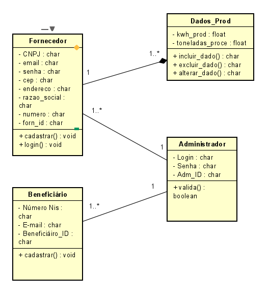
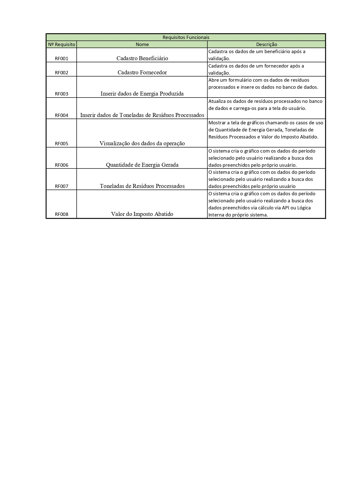
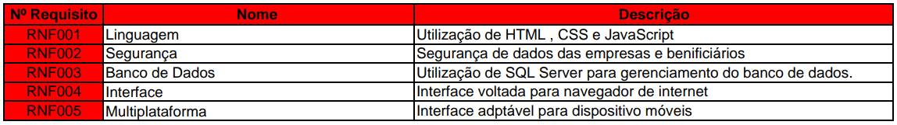
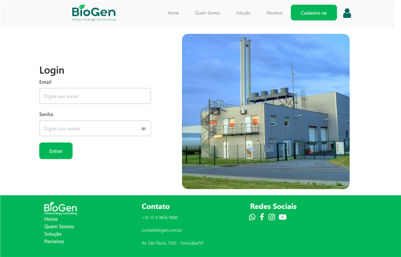
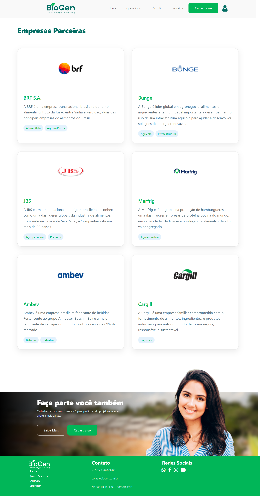
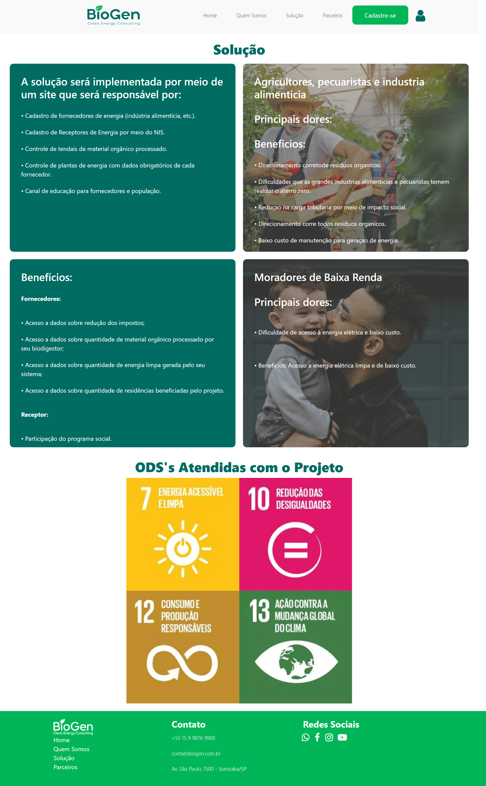

# Projeto-Biogen-2025

 

  <a href="#sobre">Sobre</a>  |  
  <a href="#publico">Público</a>  |
  <a href="#sprints">Sprints</a>  |
  <a href="#tecnologias">Tecnologias</a>  |  
  <a href="#equipe">Equipe</a>

## 📌 Status do Projeto: Em andamento

## 📖 SOBRE O PROJETO

O Projeto Integrador (PI) propõe uma aplicação voltada para gerenciar de forma eficiente fornecedores e beneficiários, com funcionalidades voltadas ao cadastro, controle e visualização de dados por meio de gráficos.

O objetivo é oferecer uma ferramenta tecnológica que facilite o acompanhamento e a gestão de dados de distribuição de recursos de forma prática e eficiente.

## 📙 ESCOPO

A aplicação contempla:

A aplicação inclui:

- Cadastro e controle de Fornecedores e Beneficiários

- Geração de gráficos e análises

- Estrutura em Node.js com TypeScript

- Armazenamento de dados via SQLite

## 💡 METODOLOGIA

A equipe seguiu uma metodologia ágil, utilizando o framework Scrum. As entregas foram organizadas em sprints semanais e as tarefas distribuídas com o auxílio de plataformas como Trello e Jira, garantindo um bom fluxo de trabalho em equipe.

## 👥 PÚBLICO-ALVO

Empresas e organizações que precisam registrar, gerenciar e acompanhar o fornecimento de recursos para beneficiários de forma estruturada, com apoio visual e relatórios claros.

 ## 📚 DIAGRAMA DE CLASSES
  

  ## 📗 REQUISITOS FUNCIONAIS 
  

  ## 📕 REQUISITOS NÃO FUNCIONAIS
   

 

## 📅 ENTREGA DAS SPRINTS

| Sprint    | Período        | Entregas                                                  | Status       |
|-----------|----------------|-----------------------------------------------------------|--------------|
| Sprint 1  | 01/04 - 15/04  | Definição do escopo, levantamento de requisitos iniciais  | ✅ Concluído  |
| Sprint 2  | 16/04 - 31/04  | Configuração do projeto, criação do banco, APIs iniciais  | ✅ Concluído  |
| Sprint 3  | 01/05 - 15/05  | CRUD de Fornecedores e Beneficiários                      | ✅ Concluído  |
| Sprint 4  | 16/05 - 30/05  | Geração de gráficos, testes e documentação                | 🟡 Em andamento |

# Demonstrativo de Telas

<h3>Home</h3>

 

<h3>Login</h3>

 

<h3>Quem Somos</h3>

 

<h3>Parceiros</h3>

 

<h3>Solução</h3>

 

<h3>Cadastro Beneficiário</h3>

 

<h3>Cadastro Fornecedor</h3>

 
## 🛠️ TECNOLOGIAS UTILIZADAS

  
  
  
  
  
  

 

## 👥 EQUIPE

| Nome              | Função                   | GitHub                             |
|-------------------|---------------------------|-------------------------------------|
| Alessandro Rodrigues| Desenvolvedor(a) Back-End | [@Alessandro](https://github.com/alerodriguesm02) |
| Daniel Rodrigues | Product Owner             | [@Daniel](https://github.com/alerodriguesm02) |
| Rafhael Cremer| Scrum Master              | [@Raphael](https://github.com/alerodriguesm02) |
| Taíse Miguel | Desenvolvedora             | [@TaiseMiguel](https://github.com/TaiseMiguel/TaiseMiguel) |
| Thiago Muniz | Desenvolvedor              | [@Thiago](https://github.com/alerodriguesm02) |

